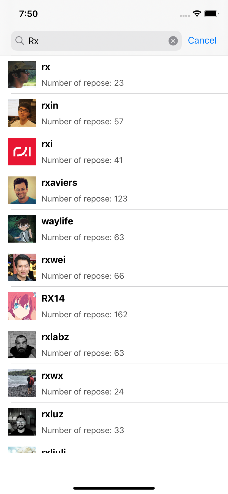

# GitHubUserSearch

   GitHubUserSearch is an example that using [ReactorKit](https://github.com/ReactorKit/ReactorKit) and [Swinject](https://github.com/Swinject/Swinject) and RxSwift

   | Receive Results | :-: |
   |  | 

   ## TODO

   - [x] Search with TextField's text
   - [x] Reflect API responses to List
   - [] converting to Combine
   - [] Separate API access from BindableObject
   - [] Use Combine with API access
   - [] Reflect responses in MainThread via Combine

   ## Requirements

   - Xcode 12 
   - Swift 5.2
   - above iOS 12

   ## References
   -  